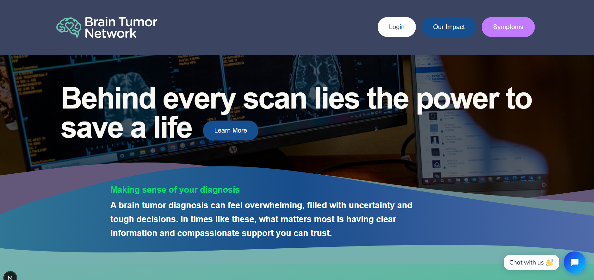
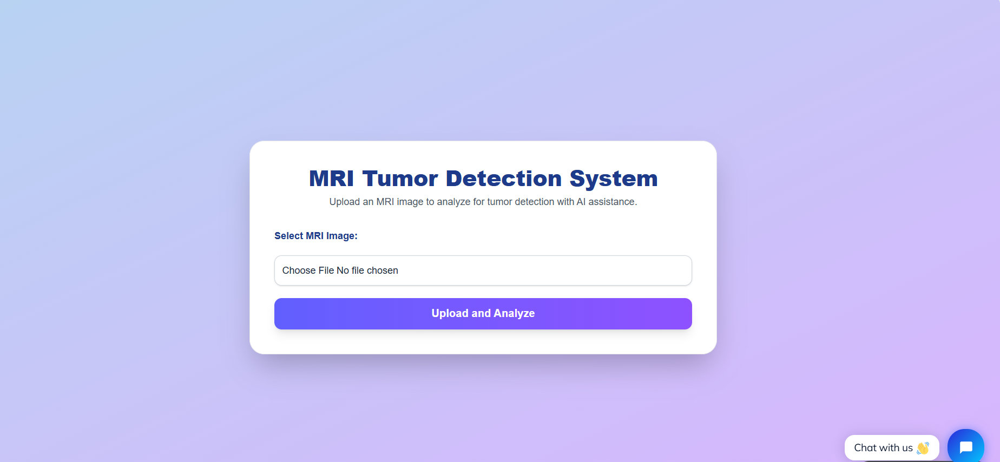
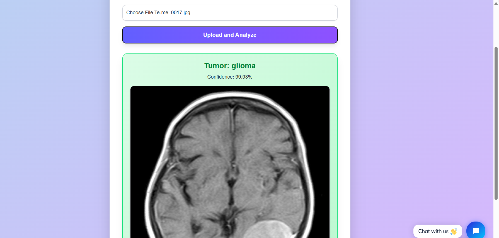

# 🧠 Brain Tumor Detection and Classification from MRI Images

An AI-powered deep learning project that automatically detects and classifies **brain tumors** from **MRI images** using **Convolutional Neural Networks (CNNs)**. The system performs both **tumor segmentation** and **multi-class classification** (e.g., **glioma**, **meningioma**, **pituitary tumor**), enabling faster and more accurate diagnosis.

---

## 🚀 Features

- ✅ Automated **brain tumor detection** from MRI scans
- ✅ **Multi-class tumor classification:** Glioma, Meningioma, Pituitary
- ✅ **CNN-based deep learning architecture**
- ✅ **Image preprocessing and augmentation** for better accuracy
- ✅ **High classification accuracy** on public MRI datasets
- ✅ Model deployment ready with **Flask** / **Streamlit** (Optional)

---

## 🛠️ Tech Stack

| Category            | Technologies                                      |
|-------------------- |-------------------------------------------------- |
| **Programming**      | Python                                            |
| **Deep Learning**    | TensorFlow, Keras                                 |
| **Computer Vision**  | OpenCV, Scikit-image                              |
| **Data Processing**  | NumPy, Pandas                                     |
| **Visualization**    | Matplotlib, Seaborn                               |
| **Deployment (Optional)** | Flask / Streamlit                         |
| **Dataset**          | Public MRI Brain Tumor Datasets (Kaggle/Figshare) |

---

---

## 🧑‍💻 Installation & Setup

### 1. Clone the Repository

```bash
git clone https://github.com/yourusername/brain-tumor-detection.git
cd brain-tumor-detection
```
### Setup Frontend

```bash
cd my-next-app
npm run dev
```
### Setup Backend

```bash
python -m venv venv
source venv/bin/activate
```
## 📸 Project Preview






> _Sample output showing tumor classification from an MRI scan (replace with your actual project result image)._

